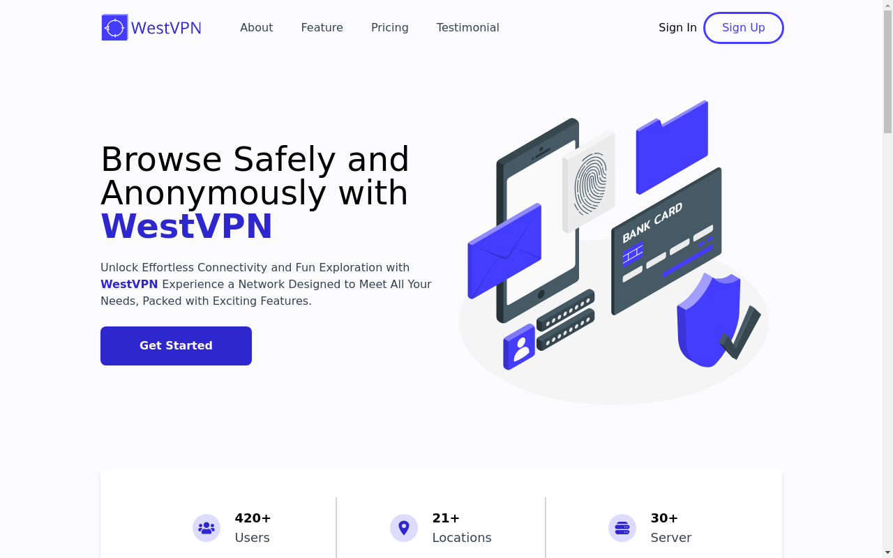

# Hello Tailwind

### About the project

React website created for the Tailwind CSS learning process.

Desktop screenshot

  <ol>
    
  </ol>

  
Mobile screenshot

  <ol>
    
  </ol>

### [Live preview](https://hello-tailwind-iota.vercel.app/)

---

### Built With

- React
- Vite
- Tailwind CSS
- React Scroll
- React Slick

---

### Resources

- Illustrations was provided by [Storyset](https://storyset.com/)
